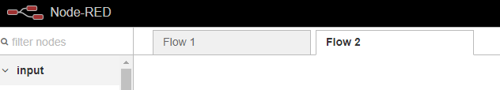
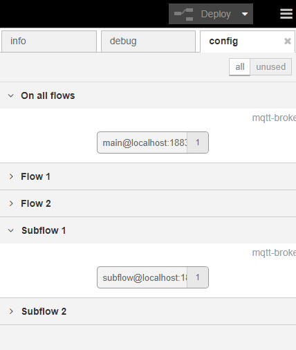
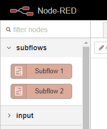

# node-red-contrib-flows_splitter
Allow flows .json to be split in multiple local file.

### Tabs
Represent the "Flow 1" and "Flow 2" tab that you create with the + sign in the following picture.



For each tab, it create a file named [flows basename]\_tab\_[order index].json

[order index] is the double digit order index ( 0 = 00, 1 = 01, .. 99 = 99)

note :  we do not support more than 99 tabs. we use the index isntead of the UUID to keep the tabs ordered as before.

### orphans
Represent the node "main@localhost" and "subflow@localhost". They are not attached to any tab since they are used in multiple node in common.



All the tabs orphans are save in the file named [flows basename]_orphans.json

note : each subflow keep a reference of his own orphans and can be seen as self-contained flows.

### subflows
Reprensent "Subflow 1" and "Subflow 2" created with top right menu.

For each subflow, it creates a file named [flows basename]\_sunflow\_[sunflow UUID].json



## Instructions
add this in settings
```
storageModule: require("node-red-contrib-mf-flows_splitter"), 
```

## known bugs :
* When we save less tabs than the previours deploy, we need to delete previous flows (but not the backups) and save 
* ~~first time you need to restart the node-red twice to be have all your tabs. fixable~~
